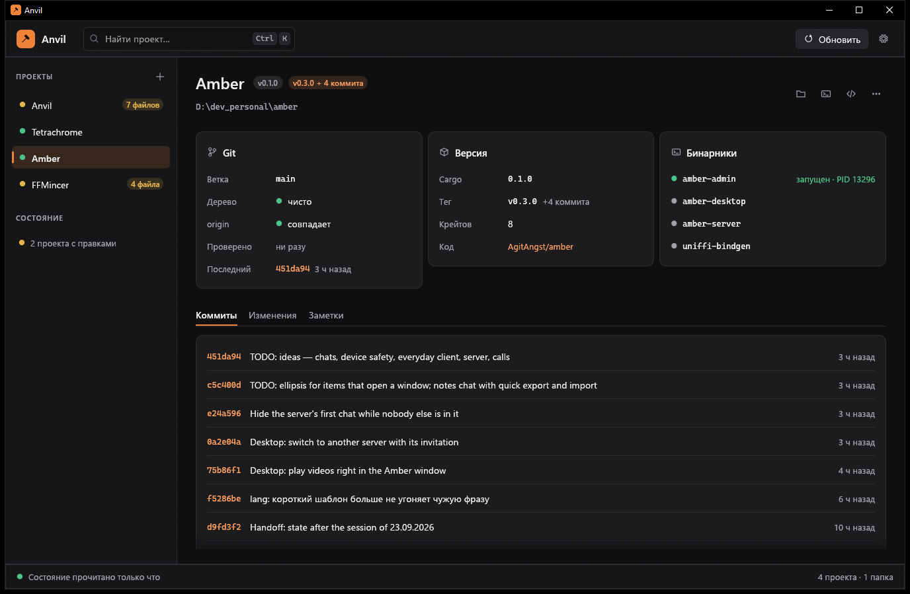

# Anvil

Командный центр для моих программ на Rust и общий набор, из которого они собраны.

- **`anvil-ui`** — единый вид всех программ на egui: темы, акцент на программу, значки,
  виджеты, каркас окна, окна «О программе» и «Настройки». Готов.
- **`anvil-update`** — проверка и установка обновлений изнутри программы: GitHub Releases,
  сверка SHA-256, установка с сохранением старой версии, перезапуск, готовый баннер. Готов.
- **`anvil`** — окно командного центра. Сейчас: все проекты и их git-состояние, версии, запущенные
  бинарники, быстрые переходы; сборка, тесты, clippy, fmt и запуск с живым логом и разбором ошибок;
  CI и выпуски с GitHub; установка программ в `%LOCALAPPDATA%\Programs` из сборки или с GitHub,
  откат на прежнюю версию, ярлык в «Пуске»; мастер выпуска (проверки → версия → заметки → тег →
  Release по соглашению); зависимости: что устарело, уязвимости по RustSec, «Обновить совместимые» с
  тестами и откатом, версия Rust и набора Anvil в каждой программе; палитра `Ctrl+K` на все действия,
  обзор всех проектов `Ctrl+0`, уведомление Windows о конце долгой задачи, строка серверов Amber
  (подробности — в `amber-admin`).

На наборе живут Anvil, Amber (клиент и `amber-admin`), Tetrachrome и FFMincer: один вид, светлая и
тёмная темы, английский и русский, проверка обновлений изнутри и выпуски по одному workflow.

Замысел, этапы и решения — в [SPEC.md](SPEC.md); где остановились — в [HANDOFF.md](HANDOFF.md);
правила внешнего вида — в [docs/STYLE.md](docs/STYLE.md); как выпускаются программы — в
[docs/RELEASES.md](docs/RELEASES.md).




## Запуск

```sh
cargo run -p anvil --release
```

Настройки — `%APPDATA%\Anvil\anvil.toml`, или `anvil.toml` рядом с exe, если он там лежит
(портативный режим). При первом запуске из репозитория Anvil ищет проекты в соседних папках.

## Витрина

```sh
cargo run -p anvil-ui --example gallery
```

Флаги: `--dark` / `--light`, `--en` / `--ru`, `--accent ember|amber|teal|rose|blue`,
`--tab elements`, `--dialog` / `--settings` / `--about`.

## Подключение `anvil-ui`

```toml
[dependencies]
anvil-ui = { git = "https://github.com/AgitAngst/Anvil", tag = "kit-v0.2.0", features = ["serde"] }
```

```rust
use anvil_ui::{Accent, CommonSettings, Icon, Kind, chrome, widgets as w};

// При запуске:
anvil_ui::install(&cc.egui_ctx, Accent::TEAL, settings.common.theme);
settings.common.apply(&cc.egui_ctx);

// В кадре:
chrome::top_bar(ui, |ui| chrome::brand(ui, Icon::Package, "Tetrachrome"));
chrome::content(ui, |ui| {
    w::card(ui, |ui| {
        if w::button(ui, Kind::Primary, Some(Icon::Play), "Упаковать").clicked() { /* … */ }
    });
});
```

- Цвета — только из `Palette::of(ui)`: тема и акцент меняются на ходу, и всё следует за ними.
- Любой текст держит контраст не меньше 4.5:1 в обеих темах и со всеми акцентами — это проверяет тест.
- Строки самого набора переводятся на EN/RU (`anvil_ui::lang`); строки программы переводит программа.
- Для правок набора «на живую» — в `.cargo/config.toml` программы (не коммитить):

  ```toml
  [patch."https://github.com/AgitAngst/Anvil"]
  anvil-ui = { path = "D:/dev_personal/Anvil/crates/anvil-ui" }
  ```

## Подключение `anvil-update`

```toml
[dependencies]
anvil-update = { git = "https://github.com/AgitAngst/Anvil", tag = "kit-v0.2.0" }
```

```rust
// При запуске:
anvil_update::cleanup();
let updater = anvil_update::Updater::new(
    anvil_update::Config::new("tetrachrome", env!("CARGO_PKG_VERSION"), "AgitAngst/Tetrachrome"),
    cc.egui_ctx.clone(),
);

// В кадре: проверка при запуске и раз в сутки (если включено), баннер вверху основной области.
updater.auto(&settings.common);
if anvil_update::ui::banner(ui, &updater, &mut settings.common) { /* сохранить настройки */ }

// «О программе»: строка состояния и кнопка «Проверить обновления».
let status = anvil_update::ui::about_status(ctx, &updater);
if chrome::about(ctx, &mut open, &info, status.as_deref()) == Some(AboutAction::CheckUpdates) {
    updater.check(settings.common.prerelease, None, true);
}
```

Выпуски программы — по [соглашению](docs/RELEASES.md): тег `vX.Y.Z`, архив
`<app>-X.Y.Z-windows-x64.zip`, `SHA256SUMS`. Собирает и публикует общий workflow
`.github/workflows/rust-release.yml`. Проверить всё на месте можно примером
`cargo run -p anvil-update --example updatable -- --version 0.1.0 --repo owner/name`.

## Лицензия

MIT
