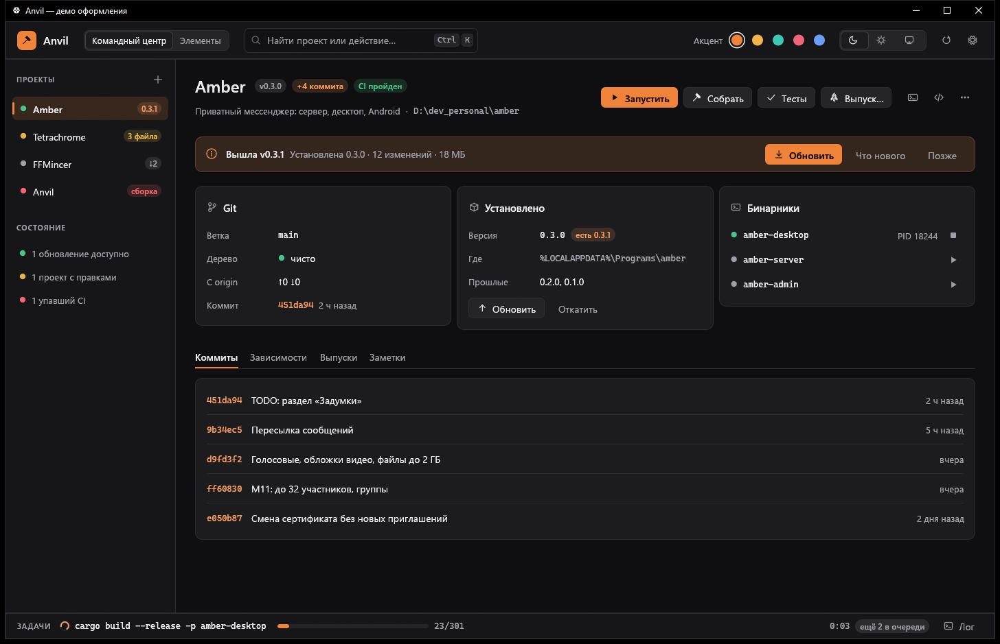
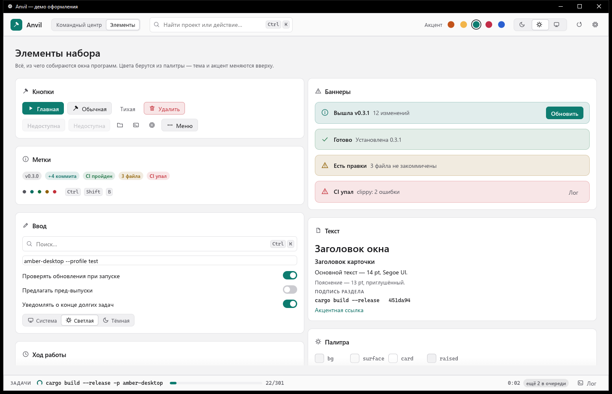
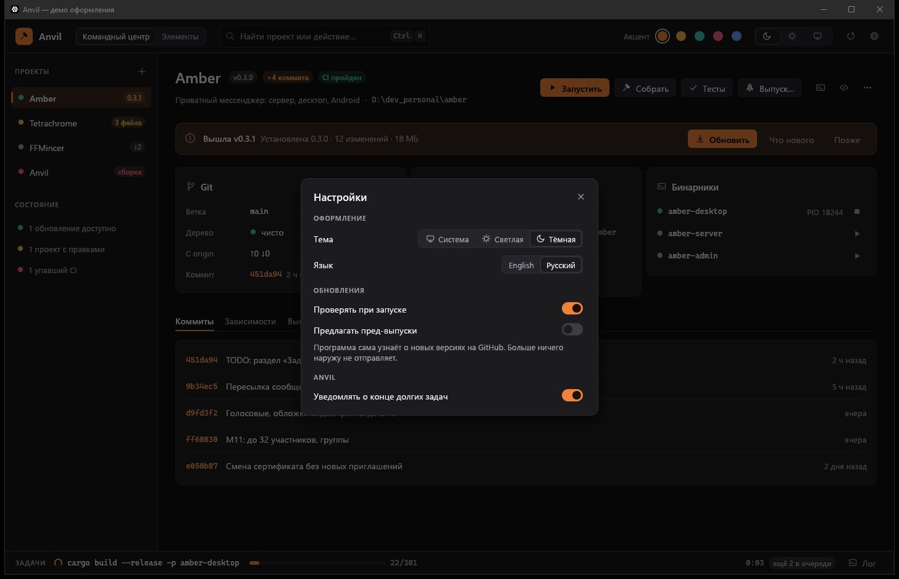

# Внешний вид программ семьи Anvil

Руководство для всех программ, собранных на `anvil-ui`: Anvil, Amber, Tetrachrome, FFMincer и новых.
Здесь — правила и значения; код — в `crates/anvil-ui`, живой пример — витрина:

```sh
cargo run -p anvil-ui --example gallery
```

Значения в этом файле совпадают с кодом на момент 23.09.2026. Если они разошлись, прав код, а файл
нужно поправить.



---

## 1. Принципы

1. **Инструмент, а не витрина.** Серые поверхности без оттенка, один цвет-акцент, мало украшений.
   Внимание достаётся данным и действиям, а не рамкам.
2. **Семья узнаётся по устройству, программа — по цвету.** Раскладка окна, шрифты, кнопки и
   отступы у всех одинаковые, а акцент у каждой программы свой.
3. **Цвет что-то значит.** Зелёный — хорошо, жёлтый — требует внимания, красный — сломано или
   необратимо, акцент — «сюда, это главное». Цвет не используют для красоты.
4. **Всё читается.** Любой текст держит контраст не меньше 4.5:1 к своему фону, в обеих темах и
   со всеми акцентами. Это проверяет тест, а не глаз.
5. **С клавиатуры — тоже.** Фокус виден, у каждой кнопки есть имя для диктора.
6. **Ничего не ломается молча.** Ошибка всегда видна: баннером, уведомлением или строкой в задачах.
   Необратимое делается только после подтверждения, где написано, что именно произойдёт.

---

## 2. Цвет

### 2.1. Токены

В коде цвета не пишутся числами: только `Palette::of(ui)` и её поля. Тогда смена темы и акцента
подхватывается сама.

| Токен | Тёмная | Светлая | Для чего |
|---|---|---|---|
| `bg` | `#0F0F11` | `#F3F3F4` | фон основной области окна |
| `surface` | `#161618` | `#FAFAFA` | шапка, боковая панель, строка состояния |
| `card` | `#1C1C1F` | `#FFFFFF` | карточки, диалоги, меню, уведомления |
| `raised` | `#252529` | `#F0F0F2` | кнопки, дорожки, подложки значков |
| `hover` | `#2B2B30` | `#E8E8EB` | подсветка под курсором |
| `border` | `#2C2C31` | `#E2E2E5` | рамки карточек, разделители |
| `border_strong` | `#3D3D44` | `#CBCBD0` | рамка под курсором, выбранный сегмент |
| `field` | `#121214` | `#FFFFFF` | фон полей ввода |
| `text` | `#ECECEE` | `#17171A` | основной текст |
| `weak` | `#A0A0A8` | `#55555D` | подписи, пояснения, неактивные значки |
| `faint` | `#6E6E76` | `#8A8A92` | плейсхолдеры, недоступное; **не для важного текста** |
| `success` | `#4CC38A` | `#16703F` | готово, пройдено, запущено |
| `warning` | `#E5B54A` | `#8F5F00` | есть правки, ломающее обновление, внимание |
| `danger` | `#F2676B` | `#C4303A` | упало, уязвимость, удаление |

Слои от нижнего к верхнему: `bg` → `surface` / `card` → `raised` → `hover`. Каждый следующий слой
светлее в тёмной теме и темнее или белее в светлой. Тени — только у всплывающего: диалогов, меню и
уведомлений.

**Мягкая подложка** `p.soft(цвет)`: цвет с прозрачностью 16 % в тёмной теме и 12 % в светлой. Из неё
делаются бейджи, выбранная строка списка, баннеры и опасная кнопка. Текст на мягкой подложке —
тем же цветом, что и подложка, но полной силы.

### 2.2. Акцент программы

У акцента три значения на каждую тему:
- `accent` — заливка главной кнопки, полосы прогресса, включённого переключателя;
- `on_accent` — текст и значки поверх заливки;
- `accent_text` — акцентный текст на обычном фоне: ссылки, хеши, выбранная вкладка.

| Акцент | Программа | Тёмная: заливка / на ней / текст | Светлая: заливка / на ней / текст |
|---|---|---|---|
| `EMBER` | Anvil | `#F0833A` / `#1B0E05` / `#F59A5C` | `#C2531A` / `#FFFFFF` / `#AD4712` |
| `AMBER` | Amber | `#F2B54A` / `#1C1403` / `#F2B54A` | `#F2B54A` / `#1C1403` / `#8A5A00` |
| `TEAL` | Tetrachrome | `#3CC8B4` / `#04201C` / `#4FD6C3` | `#0E7C70` / `#FFFFFF` / `#0B6E63` |
| `ROSE` | FFMincer | `#F0647A` / `#22060B` / `#F4808F` | `#C22D48` / `#FFFFFF` / `#B3263F` |
| `BLUE` | остальные | `#6C9EF8` / `#06142E` / `#86B0FA` | `#2A5FD0` / `#FFFFFF` / `#2556C0` |

Правила акцента:
- На экране **одна** главная кнопка, залитая акцентом. Остальные — обычные или тихие.
- Акцентом отмечают выбранное и главное, а не всё подряд. Если акцента на экране много, он
  перестаёт что-то значить.
- Новая программа сначала берёт `BLUE`. Свой акцент заводится в `Accent`, получает строки в тесте
  контраста и строку в этой таблице.

### 2.3. Смысловые цвета (`Tone`)

| `Tone` | Цвет | Когда |
|---|---|---|
| `Neutral` | `weak` | версия, счётчик, «актуально», «без CI» |
| `Accent` | `accent_text` | новое, «+4 коммита», доступное обновление |
| `Success` | `success` | CI пройден, чисто, запущено, готово |
| `Warning` | `warning` | есть правки, ломающее обновление, отстаёт от origin |
| `Danger` | `danger` | CI упал, уязвимость, ошибка сборки |

Цвет никогда не бывает единственным носителем смысла: рядом всегда есть текст («CI упал») или значок.

### 2.4. Тёмная и светлая темы

По умолчанию тема берётся из системы и переключается вслед за ней. Пользователь может закрепить
светлую или тёмную в «Настройках». Фон, которым eframe чистит окно, — `chrome::clear_color`, иначе
при изменении размера мелькает чужой цвет.

---

## 3. Текст

### 3.1. Шрифты

| Роль | Шрифт | Запасной |
|---|---|---|
| интерфейс | Segoe UI | встроенный шрифт egui |
| полужирный | Segoe UI Semibold (`semibold(размер)`) | Segoe UI Bold |
| моноширинный | Cascadia Mono | Consolas |

На Linux — Noto Sans и DejaVu Sans Mono, если они есть. За системным шрифтом всегда стоят
встроенные шрифты egui: в них есть символы, которых в системном может не оказаться.

### 3.2. Шкала

| Роль | Размер | Начертание | Цвет | Где в коде |
|---|---|---|---|---|
| заголовок экрана | 24 | полужирный | `text` | `RichText::font(semibold(24.0))` |
| заголовок диалога | 17 | полужирный | `text` | `chrome::dialog` |
| заголовок карточки | 14.5 | полужирный | `text` | `widgets::card_title` |
| основной текст, кнопки | 14 | обычный | `text` | стиль `Body`, `Button` |
| пояснение | 13 | обычный | `weak` | `widgets::note` |
| моноширинный: хеш, путь, версия, команда | 12.5 | моно | `weak` или `text` | `widgets::mono` |
| мелкое | 12 | обычный | `weak` | стиль `Small` |
| подпись раздела | 11, ЗАГЛАВНЫМИ, разрядка 0.8 | полужирный | `weak` | `widgets::section_label` |

Полужирный — для заголовков, главной кнопки, бейджей и выбранного пункта. В основном тексте
полужирный не используется.

### 3.3. Как писать

- Коротко и по делу: «Собрать», «Обновить», «Выпуск…». Многоточие ставится, если кнопка открывает
  окно и действие ещё можно отменить.
- С заглавной только первое слово: «Проверять при запуске», а не «Проверять При Запуске».
- В подтверждении пишется, **что именно произойдёт**: команды, версия, ветка. Кнопка называется
  действием («Выпустить», «Удалить»), а не «OK».
- Ошибка говорит, что сломалось и что делать дальше: «clippy: 2 ошибки · Лог», а не «Ошибка».
- Технические вещи — хеши, пути, команды, версии — пишутся моноширинным.
- Строки самого набора переводятся через `tr(ctx, "…")` (русский ключ, английский перевод в
  `lang.rs`). Строки программы переводит программа.

---

## 4. Размеры и отступы

### 4.1. Скругления (`theme::radius`)

| Имя | Значение | Что |
|---|---|---|
| `SMALL` | 4 | клавиши, мелкие детали |
| `CONTROL` | 6 | кнопки, поля, сегменты, строки списка, пункты меню |
| `CARD` | 10 | карточки, баннеры, меню, уведомления |
| `WINDOW` | 12 | диалоги |
| — | половина высоты | бейджи и переключатели: пилюли |

### 4.2. Высоты

| Что | Высота |
|---|---|
| шапка (`chrome::TOP_BAR`) | 56 |
| строка состояния (`chrome::STATUS_BAR`) | 38 |
| строка навигации | 34 |
| кнопка, кнопка-значок, сегменты, пункт меню | 30 |
| вкладки | 32 |
| бейдж | 20 |
| клавиша | 19 |
| дорожка переключателя | 20 (ширина 34) |
| полоса прогресса | 6 |

### 4.3. Отступы

| Где | Значение |
|---|---|
| основная область (`chrome::content`) | 28 по бокам, 22 сверху и снизу |
| боковая панель (`chrome::side_panel`) | 10 по бокам, 14 сверху и снизу; ширина 248 |
| шапка и строка состояния | 16 по бокам |
| внутри карточки | 16 |
| внутри баннера и уведомления | 14 × 10 |
| внутри диалога | 20 (подтверждение); 20 / 12 / 14 / 18 (обычный диалог) |
| между элементами | 8 по горизонтали, 6 по вертикали |
| между карточками | 12–14 |
| между разделами экрана | 18 |

Размеры кратны 2, крупные — 4. Новых «почти таких же» значений не заводим: берём ближайшее из таблиц.

---

## 5. Значки

- Рисуются кодом, линиями, в сетке 24 × 24 (`icons::paint`). Толщина линии — 1.7 от сетки, но не
  тоньше 1.2 px.
- Размеры: 16 — в кнопках, меню, строках; 17 — в кнопке-значке; 18 — в баннере; 22 — в пустом
  состоянии.
- Цвет — как у текста рядом: `weak` в покое, `text` под курсором, `on_accent` на акценте, цвет `Tone`
  в баннерах и уведомлениях.
- Картинки и шрифты-иконки не используем: они выглядят по-разному на разных системах.

Набор (`Icon::ALL`): `ArrowDown`, `ArrowRight`, `ArrowUp`, `Branch`, `Chat`, `Check`, `ChevronUp`,
`Clock`, `Close`, `Code`, `Copy`, `Download`, `Expand`, `File`, `Film`, `Folder`, `Gear`, `Hammer`,
`Image`, `Info`, `Layers`, `Lock`, `Minus`, `Moon`, `More`, `Monitor`, `Package`, `Pause`, `Pencil`,
`Play`, `Plus`, `Redo`, `Refresh`, `Rocket`, `Save`, `Search`, `Server`, `Stop`, `Sun`, `Terminal`,
`Tiles`, `Trash`, `Undo`, `Warning`.

`ArrowDown` — галочка вниз (раскрыть, ниже), `ChevronUp` — её пара вверх; `ArrowUp` — стрелка со
стержнем (есть новее, обновить).

Новый значок рисуется в той же сетке и той же толщиной и появляется в витрине. Проверять его
нужно в размере 16: если он там не читается, значок упрощают.

---

## 6. Раскладка окна

```
┌─────────────────────────────────────────────────────────────┐
│ ▣ Имя   [разделы]   [ поиск Ctrl K ]        переключатели ⚙ │  шапка 56, surface
├──────────────┬──────────────────────────────────────────────┤
│ ПОДПИСЬ      │  Заголовок  бейджи            [Главная] [..] │
│ ● пункт      │  пояснение                                    │
│ ● пункт      │  ┌ баннер ─────────────────────────────────┐ │
│              │  └─────────────────────────────────────────┘ │
│ боковая      │  ┌ карточка ┐ ┌ карточка ┐ ┌ карточка ┐      │  основная область, bg
│ панель 248,  │  └──────────┘ └──────────┘ └──────────┘      │
│ surface      │  Вкладка · Вкладка · Вкладка                 │
│              │  ┌ карточка на всю ширину ─────────────────┐ │
├──────────────┴──────────────────────────────────────────────┤
│ ЗАДАЧИ ◌ команда ▓▓▓░░ 214/301                    ещё 2  Лог │  строка состояния 38, surface
└─────────────────────────────────────────────────────────────┘
```

- **Шапка** (`chrome::top_bar`): слева знак и название (`chrome::brand`), потом переключатель
  разделов и поиск, справа — глобальные переключатели и меню ⚙ с «Настройками» и «О программе».
- **Боковая панель** (`chrome::side_panel`) — если есть список, по которому ходят: проекты,
  пресеты, беседы. Если списка нет, панели нет.
- **Основная область** (`chrome::content`) — прокручивается. Порядок сверху вниз: заголовок с
  действиями справа, баннер (если есть), карточки, вкладки с подробностями.
- **Строка состояния** (`chrome::status_bar`) — долгие задачи, ход, короткие подсказки. Она не
  прыгает по высоте и не прячется.
- **Знак программы** (`chrome::app_mark`) — квадрат акцента со значком программы, скругление —
  четверть стороны. В шапке он 28, в «О программе» — 56. Тот же знак — значок окна и exe
  (`appicon::icon_data`, `appicon::rgba` в `build.rs`).

| Программа | Акцент | Значок знака |
|---|---|---|
| Anvil | `EMBER` | `Hammer` |
| Amber | `AMBER` | `Chat` (в трее и уведомлениях — свой круглый значок) |
| Tetrachrome | `TEAL` | `Tiles` |
| FFMincer | `ROSE` | `Film` |

---

## 7. Компоненты

Всё ниже есть в витрине на вкладке «Элементы».



### Кнопки — `widgets::button(ui, Kind, значок, текст)`

| `Kind` | Вид | Когда |
|---|---|---|
| `Primary` | заливка акцентом, полужирный | главное действие экрана. **Одна на экран** |
| `Secondary` | `raised` с рамкой | обычные действия: «Собрать», «Тесты» |
| `Ghost` | без фона до наведения, текст `weak` | второстепенное: «Позже», «Лог», «Откатить» |
| `Danger` | мягкий красный, красный текст | необратимое. Всегда ведёт к подтверждению |

- Значок слева от текста — если он помогает узнать действие с первого взгляда.
- Недоступная кнопка любого вида выглядит одинаково: плоская, текст `faint`.
- Кнопки в ряду идут так: главная справа, отмена левее. В шапке экрана главная кнопка стоит
  левее остальных действий, чтобы её сразу было видно.
- **Кнопка-значок** (`icon_button`) — только с подсказкой (`hint`): она же имя для диктора.
- **Большая кнопка** (`button_sized(ui, Kind, значок, текст, размер)`) — не меньше заданного
  размера, значок и текст посередине. Для главной кнопки внизу панели: «Экспорт» во всю ширину
  высотой 40.

### Бейджи, точки, клавиши

- `badge(текст, Tone)` — короткое состояние рядом с названием: версия, «CI пройден», «3 файла».
  Одно-два слова.
- `dot(Tone)` — состояние в строке списка, когда слова не помещаются. Рядом всегда должен быть
  текст или подсказка.
- `kbd("Ctrl")` — клавиши в подсказках и в поле поиска.

### Карточки — `card`

Группа связанных сведений с заголовком (`card_title`: значок 16 цвета `weak` и полужирная подпись 14.5). Карточки не вкладываются
друг в друга. Строки «ключ — значение» внутри карточки — `field_row` (подпись шириной 96).

### Баннеры — `banner(Tone, заголовок, текст, действия)`

Состояние, которое касается всего экрана и держится, пока не решено: доступно обновление,
упал CI, есть правки. Ставится над карточками. Справа — одно-два действия. Два баннера подряд —
уже перебор: оставить важнейший.

### Обновление программы — `anvil_update::ui::banner`

Единственный допустимый способ сказать об обновлении: баннер в начале основной области, а не окно
при запуске. «Обновить» — главная кнопка баннера, «Позже» прячет его до следующей проверки,
«Пропустить эту версию» запоминается в `CommonSettings`. Заметки к выпуску — в окне «Что нового».

### Уведомления — `Toasts`

Короткое «сделано» или «не вышло» после действия. Появляются справа внизу над строкой состояния,
исчезают через 4 с. В уведомление не кладут то, что нужно прочитать внимательно или на что нужно
ответить: для этого есть баннер или диалог.

### Диалоги

- `chrome::dialog` — окно поверх затемнения: заголовок, крестик, прокрутка; закрывается Esc и
  щелчком мимо. Для настроек и подробностей.
- `widgets::confirm` — подтверждение: заголовок-вопрос («Выпустить Amber v0.3.1?»), по пунктам
  что произойдёт, при необходимости предупреждающий баннер; кнопки «Отмена» и действие.
  `danger = true` делает кнопку красной — для удаления.
- `chrome::about` — «О программе»: знак 56, имя, версия, строка о программе, «Проверить
  обновления», ссылка на код, «Часть семьи Anvil».

### Меню — `menu(&кнопка, ширина, |ui| …)`

Открывается под кнопкой и её же щелчком закрывается. Пункт меню (`menu_item`): значок 16, текст,
клавиши справа (`faint`). Группы разделяются `menu_separator`. Опасный пункт (`menu_item_danger`)
ставится последним, после разделителя. Недоступный пункт показывается с пояснением в скобках
(«Выпуск (нужен CI)»), а не прячется.

### Выбор

| Что | Когда |
|---|---|
| `switch` | включить или выключить: подпись слева, тумблер справа, строка на всю ширину |
| `toggle` | то же в строку, шириной по содержимому: тумблер и подпись справа, несколько в ряд («Инвертировать», «sRGB») |
| `segmented` | один из 2–4 коротких вариантов, видимых сразу: тема, язык, раздел |
| `tabs` | разделы подробностей внутри экрана: полоска акцента под выбранной вкладкой |
| `nav_item` | пункт боковой панели: точка, имя, бейдж справа; у выбранного — мягкий акцент и полоска слева |

Если вариантов больше четырёх, вместо `segmented` берут меню.

### Поиск — `search_field`

Лупа слева, подсказка `faint`, справа — клавиши вызова (`Ctrl K`). В фокусе рамка становится цвета
акцента.

### Ход работы

- `progress(Some(доля))` — когда известно, сколько осталось (cargo печатает `N/M`).
- `progress(None)` — бегущий отрезок, если неизвестно.
- `spinner` — «идёт работа» в строке, где полоса не помещается.

### Пустое состояние — `empty_state`

Значок 22 в круге `raised`, заголовок и что сделать дальше: «Заметок пока нет» и чем их наполнить.
Пустой экран без объяснения не остаётся.

### Настройки — `chrome::common_settings`

Общий раздел («Оформление»: тема, язык; «Обновления»: проверка при запуске, пред-выпуски) стоит
первым в окне настроек любой программы. Свои пункты программа добавляет ниже, под подписью
раздела со своим именем. Тема и язык применяются сразу, без кнопки «Сохранить».



---

## 8. Доступность

- **Контраст.** Каждая пара «текст — фон» из палитры проверяется тестом
  `every_text_reads_on_its_background` для всех тем и акцентов. Новая пара цветов добавляется в тест.
- **Фокус.** Самодельные элементы рисуют рамку фокуса (`focus_ring`): 2 px цвета `accent_text`.
  Элемент без видимого фокуса считается ошибкой.
- **Имена.** Каждая кнопка сообщает имя через AccessKit, даже если на экране у неё только значок.
  Переключатели и сегменты сообщают ещё и своё состояние.
- **Клавиатура.** До любого действия можно дойти клавишей Tab. У частых действий есть сочетания
  клавиш, и они подписаны в меню и подсказках.
- **Курсор.** Над тем, что нажимается, курсор становится рукой. Над недоступным — нет.

---

## 9. Как расширять

- **Нужен новый цвет** — сначала проверить, не подходит ли токен или `Tone`. Если правда нужен:
  - общий для всех — поле в `Palette` для обеих тем и пары в тесте контраста;
  - свой для программы (например, пузыри Amber) — в коде программы, но вычисленный из `Palette`
    или с собственным тестом контраста.
- **Нужен новый виджет** — сначала проверить, нельзя ли собрать его из имеющихся. Если нельзя:
  функция в `widgets.rs` рисует всё из `Palette`, берёт размеры из таблиц выше, рисует фокус,
  сообщает имя и появляется в витрине.
- **Нужна новая строка набора** — через `tr(ctx, "…")` и перевод в `lang.rs`, иначе упадёт тест.
- **Готовое правило** — дописать в этот файл, чтобы следующая программа сделала так же.

## 10. Чего не делать

- Писать цвета числами в коде программы.
- Ставить две главные кнопки на один экран.
- Показывать ошибку только цветом или только в логе.
- Удалять или публиковать без окна подтверждения.
- Заводить «почти такие же» отступы, скругления и размеры шрифта.
- Прятать недоступное без объяснения, почему оно недоступно.
- Использовать `faint` для текста, который нужно прочитать.
- Использовать эмодзи и шрифтовые символы вместо значков набора.
